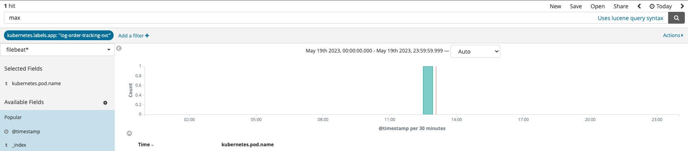

---
runme:
  id: 01HFE4J8HJS2R1RW2XVK4KV8PT
  version: v2.0
---

# Processing of order tracking event failed and max retries was reached Issue

Owning team: LTT
Keywords: on-call, supply-chain, tracking
Last verified: July 7, 2023
Status: Not started

[](https://runme.dev/api/runme?repository=https%3A%2F%2Fgithub.com%2Fpietersp%2Frunme-demo.git%26fileToOpen%3DProcess_failed_events.md)

## **Description of Issue**

The Order Tracking Service is responsible for receiving and processing Order Tracking Events. when an error occurs with processing a courier update, the service will automatically attempt to reprocess the record from the Kafka topic: log-order-tracking-events; if a failure occurs, a record is placed on the `log-order-tracking-events-retry` topic for reprocessing to take place.

If a failure has occurred and exceeded the maximum retries threshold, we will receive an alert, and should we need to replay these events to the order tracking service, the following process can be used:

## **Why Is It Happening?**

A common processing error includes timeouts to downstream endpoints such as SCO or SUP.

## **How To Address the Issue?**

### Step 0 - Get the tools

You will need the following tools for this runbook. Please install them locally if you have not done so.
- Python
- psql
- jq

```bash
brew install jq
brew install python
brew install libpq
```

### Step 1 - Get the events

The easiest is to go to Kibana and look for the log with the failure details



or stern

```bash {"id":"01HFEEAJTZ2FG24VY3MNM7WSPG","promptEnv":"false"}
# Please select the kubernetes context you wish to use

export KUBECONTEXT="gke_tal-pre-prod-logistics_europe-west1_logistics-gke1"
# export KUBECONTEXT="gke_tal-production-logistics_europe-west1_logistics-gke1"
```

```bash {"id":"01HFE4J8HJS2R1RW2XVER1B15R"}
# Grab all the logs from the failed events and place them in a timestamped log file for further gymnastics
# PLEASE NOTE YOU NEED STERN VERSION > 1.23.0 FOR THIS TO WORK
 
stern --context $KUBECONTEXT --no-follow log-order-tracking-svc | grep "Unable to process order tracking event" | tee $(date +%s)-log-order-tracking.log
```

### Step **2 - Find out the reason for the failure**

You have 2 options

- **Option 1: Got an invalid parcel ID with MDX-1**

   This flow is there specifically for parcels that don't exist in LOG yet. So you're going to need to dive a bit deeper to see why the events failed to process.

   💡 Remember the scanning of Coke cans and sh*t [here](https://takealot.slack.com/archives/C010PT2R0NP/p1684494723648739?thread_ts=1684493394.499539&cid=C010PT2R0NP)

- **Option 2: Got a valid parcel ID that needs to be replayed**

   Go to part 3 and replay the event

### **Part 3 - Resend the events**

The following is to get credentials for the express database (from `log-order-tracking-svc`)
Copy the password for the db user

```bash {"background":"false","id":"01HFEEAJTZ2FG24VY3MQQ6Q8KR","interactive":"true"}
export $(kubectl --context=$KUBECONTEXT exec deploy/log-order-tracking-svc -- printenv | grep EXPRESS_DB_PASSWORD)
```

The following SQL will retrieve all records that reached the maximum attempts and need to be replayed

```bash {"id":"01HFEEAJTZ2FG24VY3MR1C7PQ3"}
export DATESTART="<ENTER DATE HERE>"

echo "
SELECT row_to_json(t)
FROM(
    SELECT  c.waybillid, c.suppliercode, c.payload
    FROM mrdexpress.callbacklog c 
    WHERE c.added > '$DATESTART 00:00' AND c.added < '$DATESTART 23:59'
    AND c.log LIKE '%maximum retries%'
) t" > ./get_failed_events.sql
```

```bash {"id":"01HFEEAJTZ2FG24VY3MTJ7FB16","interactive":"false","mimeType":"application/json","terminalRows":"20"}
PGPASSWORD=$EXPRESS_DB_PASSWORD psql -U log-order-tracking-svc -h express.db.gcp.mrdexpress.uat -d postgis -t -f get_failed_events.sql | jq -s
```

Run the following Python script which will replay all the failed entries

Take note that the `trackingStatus` and potentially the TrackingMethod may need to be aligned according to the events being replayed

```python {"id":"01HFE4J8HJS2R1RW2XVJVADWK7","interactive":"false","mimeType":"text/csv"}
import requests
import json
import os


env_var = os.getenv('__')
tracking_events = json.loads(env_var)

url = "http://log-order-tracking-svc.gcp.mrdexpress.uat/api/force-order-tracking"

for event in tracking_events:
    payload = {
        "allowedRetries": 3,
        "waybill": 'MDX'+str(event["waybillid"]),
        "trackingMethod": "statusupdates",
        "supplierCode": event["suppliercode"],
        "trackingStatus": 30,
        "payload": json.loads(event["payload"])
    }
    # response = requests.post(
    #     url = url,
    #     json = payload
    # )
    response='OK - 200'
    print('Waybill ID {}, Response {}'.format(event["waybillid"], response))
```
